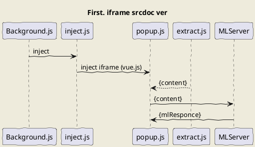
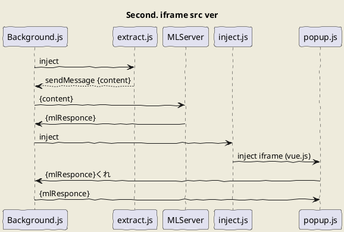
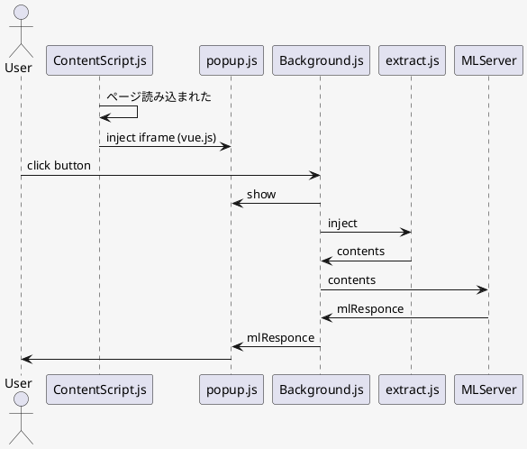
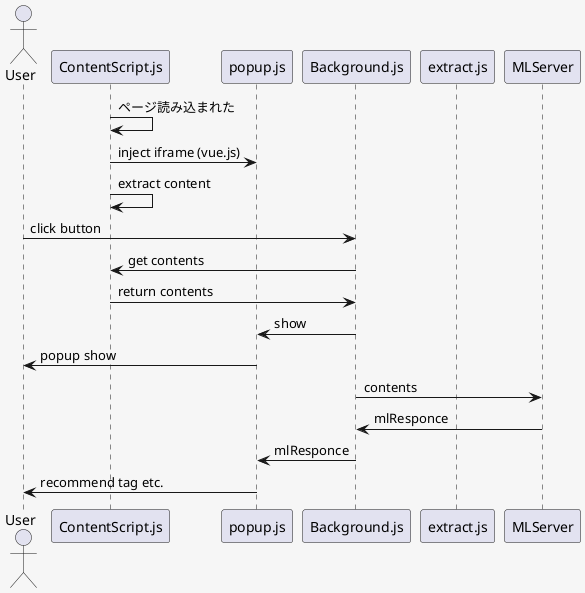
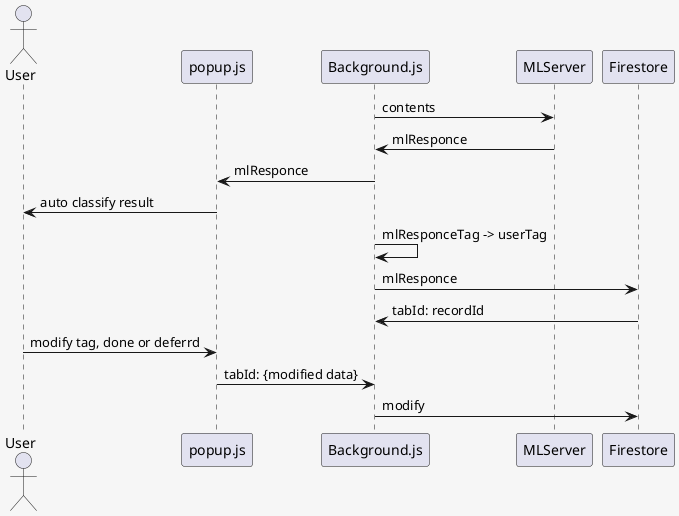
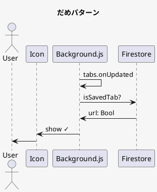
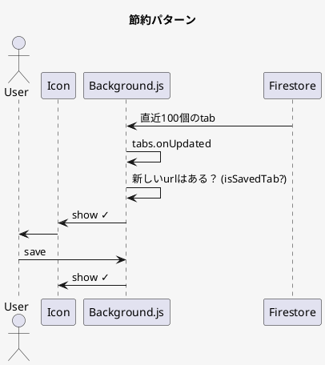
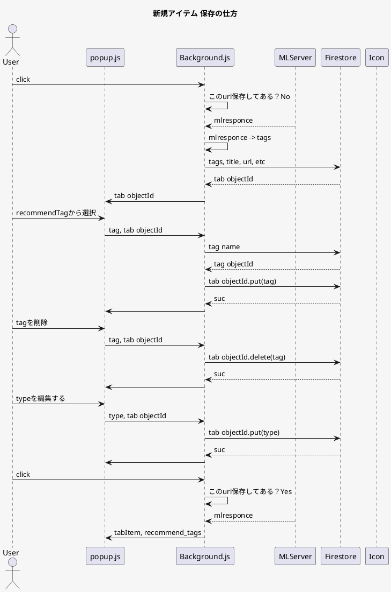

## First approach
```plantuml

skinparam backgroundColor f6f6f6
title First. iframe srcdoc ver
actor User

participant "Background.js" as b
participant "inject.js" as i
participant "popup.js" as p
participant "extract.js" as e
participant "MLServer" as m

User -> b: click button
b -> i: inject
i -> p: append iframe (vue.js)
e -> p: contents
p -> m: contents
p <- m: mlResponce

User <- p: 
```
iframeのsrcdocにhtmlを入れる方式だと、ページのコンテンツにアクセスできる（srcだとできない)ので、popupで文章を取って推論サーバーに投げて表示するだけでいいのでシンプルな実装になる。ただ推論サーバーがhttpだとmixed requestでhttpsのサイトから投げれない。background.jsで推論させたほうが良いのではと思った。

## Secound approach

```plantuml
skinparam backgroundColor f6f6f6
title First. iframe srcdoc ver
actor User

participant "Background.js" as b
participant "extract.js" as e
participant "MLServer" as m
participant "inject.js" as i
participant "popup.js" as p

User -> b: click button
b -> e: inject
b <- e: contents

b -> m: contents
b <- m: mlResponce

b -> i: inject
i -> p: inject iframe (vue.js)
p -> b: mlResponceくれ
p <- b: mlResponce
```

先にbackground.jsで推論サーバーに投げて、待ってる間にvue.jsのpopupをレンダリングする方式。シングルスレッドなので推論サーバーの待ち時間にレンダリングをやっている　なんてことはできていなかった。残念。vue.jsのレンダリングが遅い。
```
ボタンを押してからvue.jsのmountedまでの時間

推論サーバーに問い合わせる場合

<!-- ## アイコンを押してからの処理の流れ -->

iframeのsrcdocにhtmlを入れる方式だと、ページの文章を取得できる(srcだとできない)ので余計なファイルや内部通信がいらないのでシンプルにできる。
ただ、推論サーバーがhttpだとmixed requestでエラる。
background.jsで推論サーバーと通信させたほうが良いのではと思った。


先にbackground.jsで推論サーバーに投げて、待ってる間にvue.jsのpopupをレンダリングする方式。popup.jsからbackground.jsに50msに一回、推論結果がを問い合わせている。
この方法がベストだと思ったが、vue.jsのpopupのレンダリングが結構遅い
```
ボタン押したときからvue.jsのmountedまでの時間

推論サーバー投げた時

1046ms
317ms
841ms


推論サーバーに問い合わせない場合　（単純なvue.jsの表示）
294ms
223ms
494ms
434ms
```

遅い。contentScriptで先にvueをレンダリングしておいて、ボタンを押したらアニメーションで可視化するようにしたら早いのではないか。

## Third approach



## TIME
- ボタンを押してからextract.jsでコンテンツを取得しbackground.jsに返すまでの時間
118
117
110
124
74
- ボタンを押してからextract.jsでコンテンツを取得し、mlserverに投げてから帰ってくるまでの時間
351
932
942
368

コンテンツ取得に100msくらいかかる。タブが更新されたら予めコンテンツを収集しておくのもあり。
やり方としては、
- contentScriptで常に取得して保持しておき、ボタンを押したらbackgroundから問い合わせる。
- backgroundでタブの状態を検知し、extract.jsを走らせる?

mlserverが遅い、同じページで2回やると早くなるため、word2vecをキャッシュしているのではと思う

## Fourth approach



## CRUD



## isSaved?
昔保存したか？タブ変わる度にFireStoreにクエリを叩くのは違う気がする。ここ直近でいい気がする。
例えば、直近100件をBackground.jsに保持しておいて、tabs.onUpdateの度にそこにurlがあるか確認する。




## 新規アイテム 保存の仕方



## Problem
- ログインサインアップ遷移
- Background.jsでどうやってUser/Tagsを保持するか（vuexかvanillaか）
- popupを開いている最中にタグの更新があってもPopup中のタグは更新しない
- User/Tagsをどうやって変換してMLServerに送信するか
- mlResponceをUser/Tagsにどうやって変換し保存するか。
- BackgroundでFireStoreを変更する関数は何が必要か
- recommend tagをクリックしたらFireStoreに保存して帰ってきたIDを使用する。

## TODO
- インストールした時、すでにあるタブはcontentscript.jsが仕込まれていないので、injectする
- mlResponceの結果をurlをkeyにキャッシュする
- urlが変わる時popupを非表示する？
